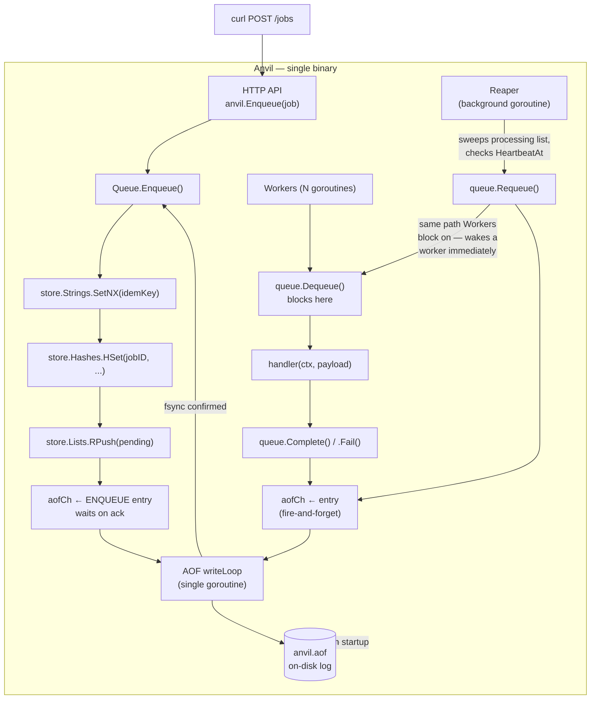

# Anvil

Anvil is a zero-dependency, single-binary, fault-tolerant background processing system for Go. It embeds a stripped-down, Redis-like storage engine directly into the queue process, eliminating network hops and giving you true in-memory atomicity.

Anvil is the third project in a distributed systems series, combining the storage engine from [Valkyr](https://github.com/lande26/Valkyr) with the orchestration logic from [ForgeQueue](https://github.com/lande26/ForgeQueue).

## Architecture

Anvil operates as a single OS process. The database is in-memory and state is persisted to disk using a purpose-built Append-Only File (AOF).



## Features

- **Embedded Storage Engine**: Uses native Go data structures (strings, hashes, lists) wrapped in `sync.Mutex` for zero-serialization, zero-RPC data access.
- **Atomic Operations**: True in-memory atomicity. No need for distributed locking or Lua scripts.
- **AOF Persistence**: Commands are written to an Append-Only File (`anvil.aof`) to survive crashes.
- **AOF Compaction**: Periodically rewrites the log to prevent unbounded disk growth.
- **Configurable Durability**: Choose between `always` (fsync on every write), `everysec` (Redis-style background fsync), or `no` (OS handles flushing).
- **Idempotency**: Prevent duplicate jobs using `idempotency_key`.
- **Fault-Tolerant**: A background Reaper rescues jobs if a worker crashes mid-execution.
- **Graceful Shutdown**: SIGTERM handlers ensure in-flight jobs finish and the AOF is flushed before exit.
- **Zero External Dependencies**: Standard library only. No `go-redis`, no separate database to provision.

## Getting Started

### 1. As an Embedded SDK

The most powerful way to use Anvil is to embed it directly into your own Go application. Your application *is* the queue.

```go
package main

import (
	"context"
	"encoding/json"
	"log/slog"
	
	"github.com/lande26/anvil"
)

func main() {
	a, _ := anvil.New(anvil.Config{
		DataDir:     "./data",
		Concurrency: 10,
		HTTPAddr:    ":8080", // Exposes /jobs, /healthz, /queues/stats
	})

	// Register a job handler
	a.RegisterHandler("send-email", func(ctx context.Context, payload json.RawMessage) error {
		// Parse payload and send email
		slog.Info("Sending email...")
		return nil
	})

	// Run blocks and handles graceful shutdown
	a.Run(context.Background())
}
```

### 2. As a Standalone Server

If you prefer to run Anvil as a separate service and interact via HTTP:

```bash
git clone https://github.com/lande26/anvil.git
cd anvil
go build -o anvil ./cmd/anvil
./anvil
```

Submit a job via curl:
```bash
curl -X POST http://localhost:8080/jobs \
  -H "Content-Type: application/json" \
  -d '{
    "type": "send-email",
    "payload": {"to": "user@example.com"}
  }'
```

## Tradeoffs

Why embed the database?

**What you gain:**
- **~10x lower latency**: No network hops (RPC) between the queue and the database.
- **Simplicity**: One binary to deploy. No Redis to monitor, patch, or back up.

**What you give up:**
- **Horizontal Scaling**: All workers run in the same process. You cannot spin up Anvil on a second machine and have them share the same queue.
- **Ecosystem**: You lose the rich tooling and observability that comes with standard Redis.

Anvil is designed for workloads that can easily fit on a single modern machine but still demand durability, retries, and clean orchestration.
